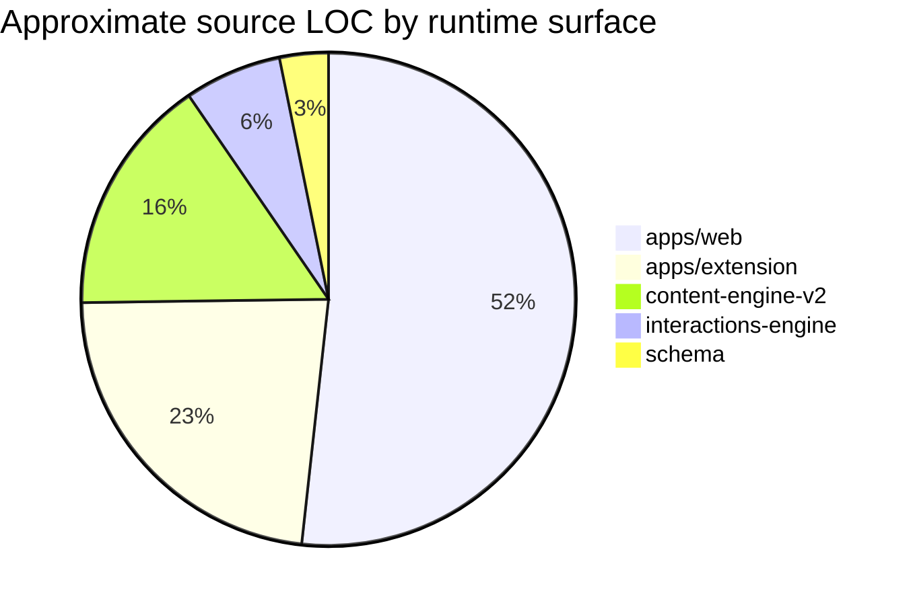
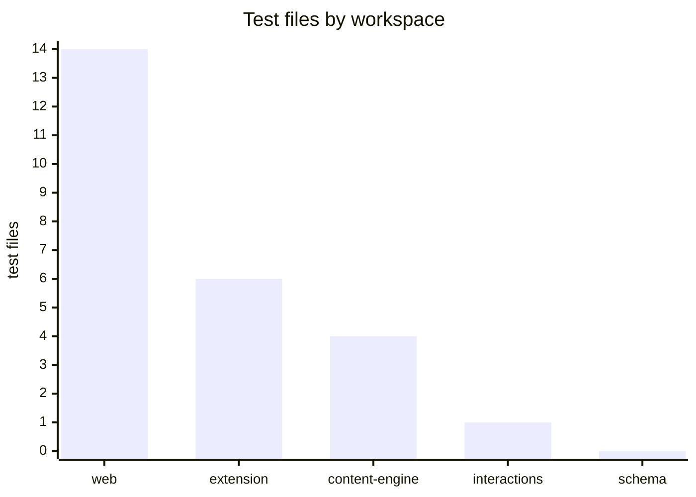
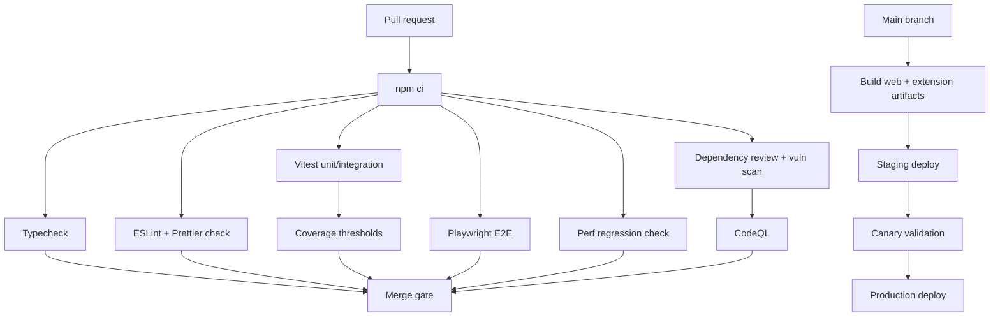
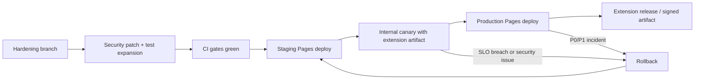

# Repository-wide hardening plan for AEONTHRA and Gemini deployment

## Executive summary

I treated the repository itself as the source of truth and treated the pasted “prior plan” only as background context. That matters, because the pasted plan is for a Linux packaging monorepo built around `anda.hcl` and RPM `.spec` files, which is structurally different from this repository’s actual stack. Applying that plan literally would send work into the wrong areas. fileciteturn0file0

The repository I inspected is a TypeScript monorepo with five real delivery surfaces: a Vite/React web app in `apps/web`, a Manifest V3 Chrome extension in `apps/extension`, and three shared packages in `packages/content-engine-v2`, `packages/interactions-engine`, and `packages/schema`. The repo currently contains 250 files, 124 TypeScript/TSX files, 25 test files, 2 GitHub Actions workflows, and a large amount of root-level documentation and historical reports. The architecture is fundamentally client-heavy and local-first: the web app is a static site, the extension captures Canvas content, and the current checked-in product explicitly avoids runtime AI calls.

The strongest parts of the codebase are its typed shared contract surface, the deterministic content-engine benchmark corpus, the extension build validation script, and the fact that CI already performs typecheck, test, and build on pull requests. The biggest risks are concentrated in four areas: a broad bridge trust boundary between extension and page, extremely large monolithic files, uneven test density across workspaces, and a CI/security posture that is still “good skeleton, not yet production-grade.”

For Gemini specifically, the most important architectural conclusion is this: **Gemini should not be added as a direct browser key call from the static site or Chrome extension.** Google’s own documentation says direct web-client Gemini usage is for prototyping, and recommends either entity["organization","Firebase","app platform"] AI Logic for production client apps—with App Check and abuse protections—or a server-side path via entity["organization","Google Cloud","cloud platform"] Vertex AI for enterprise deployment and control. That means the safest AEONTHRA path is: keep capture, validation, and deterministic preprocessing local; send only a sanitized, minimal prompt payload to a secured Gemini boundary; and keep the extension completely out of direct model access. citeturn0search7turn7search0turn7search16turn7search1turn7search2

## Repository inventory and baseline

### What is actually in the repo

| Area | Files | Approx. source files | Approx. test files | Approx. source LOC | Notes |
|---|---:|---:|---:|---:|---|
| `apps/web` | 74 | 49 | 14 | 15,493 | Main product UI, storage, source import, shell mapping |
| `apps/extension` | 28 | 13 | 6 | 6,900 | MV3 extension, service worker, content scripts, popup |
| `packages/content-engine-v2` | 28 | 21 | 4 | 4,688 | Deterministic engine and benchmark corpus |
| `packages/interactions-engine` | 17 | 15 | 1 | 1,907 | Interaction logic with thin direct coverage |
| `packages/schema` | 3 | 1 | 0 | 956 | Shared contract surface, no direct test file |
| `.github/workflows` | 2 | 2 | 0 | 85 | Verify and Pages deploy only |
| Root/docs/other | 98 | — | — | — | 83 markdown files, logs, temp assets, reports |

Two structural facts matter immediately.

First, the code is concentrated in a few very large files. The top five non-test source files account for about **31% of all source LOC**:

- `apps/extension/src/service-worker.ts` — 2,165 LOC  
- `apps/web/src/AeonthraShell.tsx` — 1,950 LOC  
- `apps/web/src/App.tsx` — 1,751 LOC  
- `apps/web/src/lib/shell-mapper.ts` — 1,698 LOC  
- `apps/extension/src/content-canvas.ts` — 1,688 LOC  

Second, test density is uneven. `apps/web` and `apps/extension` have meaningful direct coverage, `packages/content-engine-v2` has some high-value benchmark and compatibility testing, but `packages/interactions-engine` has only one direct test file and `packages/schema` has none.





### What CI and deployment currently do

The repo currently uses entity["organization","GitHub","developer platform"] Actions with two workflows:

- `verify.yml`: runs on pull requests and on pushes to non-main branches; performs `npm ci`, `npm run typecheck`, `npm test`, and `npm run build`
- `deploy-pages.yml`: runs on `main`/`master`; performs `npm ci`, `npm run build:web`, uploads the `apps/web/dist` Pages artifact, and deploys it to GitHub Pages

That is a solid baseline, but it leaves several important gaps:

- `main` branch does **not** run the full verify workflow after merge
- deployment runs **web build only**, not full tests or extension build
- there is no lint job, no coverage gate, no E2E browser job, no security scan, no dependency review, no flaky-test detection, no performance budget, and no CODEOWNERS/workflow hardening layer

The current deployment mechanism itself is aligned with official GitHub Pages guidance and the official Pages artifact/deploy actions, but it is still a minimal pipeline rather than a release-quality system. citeturn5search14turn6search0turn6search1turn6search3

### Current strengths worth preserving

The repo already has several assets I would build on rather than replace.

The extension build script validates that all manifest-referenced files exist and explicitly checks for ESM syntax in classic MV3 content scripts. That is exactly the kind of fail-fast packaging validation worth keeping. The content engine already has a benchmark corpus and repeated determinism checks. The repo also uses shared schemas and validation across extension and app boundaries, which is the right architectural seam for future hardening.

## Gemini deployment posture

This codebase is not currently “one config change away” from Gemini. It is explicitly designed as a local-first deterministic system with no runtime AI calls. So the right question is not “How do I flip Gemini on?” but “Where should a Gemini boundary live without breaking correctness, security, or the local-first posture?”

My recommendation is:

- keep **capture**, **validation**, **schema enforcement**, **noise rejection**, and **deterministic preprocessing** local
- keep the **extension** as a capture and handoff tool only
- put any Gemini call behind either:
  - a **Firebase AI Logic** integration if the goal is a production client-side web path with App Check and managed abuse protections, or
  - a **Vertex AI server-side boundary** if the goal is enterprise controls, custom prompt policy, centralized observability, and stronger governance

This is the cleanest fit with both the repo’s current architecture and Google’s guidance. Google explicitly says that the direct JavaScript Gemini SDK path in mobile/web apps is for prototyping and recommends moving to Firebase AI Logic or a server-side setup for production. Firebase AI Logic adds App Check and per-user protections; Vertex AI is the more enterprise-oriented deployment posture. citeturn0search7turn7search0turn7search2turn7search16turn7search3

For AEONTHRA specifically, that means the prompt boundary should receive a **sanitized learning artifact**, not raw page HTML, not whole extension queues, and not opaque browser state. In practice, the right payload is likely the already-validated learning bundle or a reduced projection of it. This preserves the current deterministic engine as a truth-preserving preprocessing layer and makes any Gemini response an augmenting layer rather than the primary system of record.

## Prioritized actionable checklist

Hours below assume one experienced TypeScript/React engineer with repo context. If the implementer is also learning the codebase, double the estimate.

| Priority | I will do this | Why it matters | Effort | Risk if deferred |
|---|---|---|---:|---|
| P0 | **Harden the extension↔page bridge trust boundary** by replacing broad origin patterns, validating `sender.url`, and using exact page origins instead of `*` in `postMessage` | Current bridge scope is overly broad and creates the highest security risk in the repo | 8–14h | **Critical** |
| P0 | **Add extension-to-web browser E2E** for capture → queue → import → ack cleanup | The README itself says the real browser-mediated proof is still manual; that is the biggest correctness gap before deployment | 20–36h | **High** |
| P0 | **Delete, archive, or quarantine `apps/web/src/AeonthraShell.tsx`** unless it is still required; if required, put it on a typed extraction plan | It is a 1,950-line `// @ts-nocheck` file and appears to be unused by `App.tsx`; dead or untyped monoliths are long-term defect magnets | 6–12h to quarantine, 24–40h to fully extract | **High** |
| P1 | **Add direct tests for `packages/schema` and deeper tests for `packages/interactions-engine`** | Schema is a core contract seam with zero direct test files; interactions-engine has thin direct coverage | 12–20h | **High** |
| P1 | **Refactor large monoliths**: `service-worker.ts`, `content-canvas.ts`, `App.tsx`, `shell-mapper.ts` | Top-five files hold ~31% of source LOC; defect rate and review difficulty both rise sharply in files of this size | 24–60h | **High** |
| P1 | **Add lint, formatter, coverage, changed-files reporting, and CI artifacts** | Current CI validates correctness at a coarse level but not maintainability or review ergonomics | 12–18h | **Medium** |
| P1 | **Fix brittle and nondeterministic tests** starting with `apps/web/vite.config.test.ts` and any real-clock/random helpers | There is at least one path-name-coupled test, plus several tests that should move to controlled clocks/IDs | 6–10h | **Medium** |
| P1 | **Add security scans**: CodeQL, dependency review, lockfile vulnerability scans, workflow hardening | Official tooling exists and integrates cleanly with GitHub Actions | 6–12h | **Medium** |
| P2 | **Add performance budgets**: bundle-size budget, benchmark budget, ingest timing budget, Lighthouse CI | The repo already has a benchmark corpus; it should become an enforced regression gate | 8–16h | **Medium** |
| P2 | **Reduce client weight** by lazy-loading DOCX/PDF parsers and self-hosting fonts | Current web UI imports remote fonts and statically imports at least one heavy ingest library | 6–12h | **Medium** |
| P2 | **Automate dependency maintenance** with Dependabot or Renovate plus PR grouping rules | Toolchain dependencies are central to build correctness and security | 4–8h | **Medium** |
| P2 | **Add release hygiene**: CODEOWNERS, pinned action SHAs, extension artifact publishing, version stamping | This lowers workflow supply-chain risk and improves auditable releases | 6–12h | **Medium** |
| P3 | **Archive root-level reports and remove tracked logs/temp assets** | The repo is currently documentation-heavy enough to increase cognitive overhead | 3–6h | **Low** |

## Representative refactors and patch templates

### Lock down the bridge trust boundary

This is the most important code change in the repo.

Current risks from inspection:

- `manifest.json` allows very broad host matches, including `https://*/courses/*`
- `validateAeonthraUrl()` accepts any `*.github.io` host
- `content-bridge.ts` posts messages back to the page with `window.postMessage(..., "*")`
- `service-worker.ts` processes `bridge-message` without verifying the sender origin

The repo should move from **pattern trust** to **exact-origin trust**.

```ts
// apps/extension/src/core/platform.ts
const EXACT_BRIDGE_ORIGINS = new Set([
  "https://aeonthra.github.io",
  "http://localhost:5176",
  "http://127.0.0.1:5176",
]);

export function isAllowedBridgeOrigin(urlValue: string): boolean {
  try {
    const url = new URL(urlValue);
    return EXACT_BRIDGE_ORIGINS.has(url.origin);
  } catch {
    return false;
  }
}

export function validateAeonthraUrl(
  value: string,
): { ok: true; normalizedUrl: string } | { ok: false; message: string } {
  try {
    const url = new URL(value.trim());
    if (!isAllowedBridgeOrigin(url.toString())) {
      return {
        ok: false,
        message:
          "AEONTHRA URL must be one of the explicitly trusted bridge origins.",
      };
    }
    return { ok: true, normalizedUrl: url.toString() };
  } catch {
    return { ok: false, message: "AEONTHRA URL must be a valid absolute URL." };
  }
}
```

```ts
// apps/extension/src/content-bridge.ts
const PAGE_ORIGIN = window.location.origin;

function postToPage(message: BridgeMessage): void {
  window.postMessage(message, PAGE_ORIGIN);
}

window.addEventListener("message", (event) => {
  if (event.source !== window) return;
  if (event.origin !== PAGE_ORIGIN) return;

  const parsed = BridgeMessageSchema.safeParse(event.data);
  if (!parsed.success) return;

  const message = parsed.data;
  if (
    message.type === "NF_IMPORT_REQUEST" ||
    message.type === "NF_PACK_ACK" ||
    message.type === "NF_PONG"
  ) {
    void relayToExtension(message);
  }
});
```

```ts
// apps/extension/src/service-worker.ts
import { isAllowedBridgeOrigin } from "./core/platform";

function assertTrustedBridgeSender(sender: chrome.runtime.MessageSender): void {
  const url = sender.url ?? sender.tab?.url ?? "";
  if (!isAllowedBridgeOrigin(url)) {
    throw new Error(`Rejected bridge message from untrusted sender: ${url || "unknown"}`);
  }
}

if (type === "bridge-message") {
  try {
    assertTrustedBridgeSender(sender);
  } catch (error) {
    return {
      ok: false,
      message: error instanceof Error ? error.message : "Untrusted bridge sender.",
    };
  }

  const parsed = BridgeMessageSchema.safeParse((message as { payload?: unknown }).payload);
  if (!parsed.success) {
    return { ok: false, message: "Bridge payload was invalid." };
  }

  // existing logic...
}
```

This change is aligned with Chrome’s own least-privilege guidance around host permissions, `activeTab`, and runtime script injection. Chrome’s documentation explicitly positions `activeTab` as a lower-risk alternative to broad persistent host permissions. citeturn8search0turn8search1turn8search8turn8search11turn8search12

### Lazy-load heavy client-only parsers

`pdfjs-dist` is already lazy-loaded. `mammoth` is not. For a static app, that is unnecessary startup weight.

```ts
// apps/web/src/lib/docx-ingest.ts
let mammothLoader: Promise<typeof import("mammoth/mammoth.browser")> | null = null;

async function loadMammoth() {
  if (!mammothLoader) {
    mammothLoader = import("mammoth/mammoth.browser");
  }
  return mammothLoader;
}

export async function extractTextFromDocx(file: File): Promise<ExtractedDocx> {
  const mammoth = await loadMammoth();
  const arrayBuffer = await file.arrayBuffer();

  const [htmlResult, rawTextResult] = await Promise.all([
    mammoth.convertToHtml({ arrayBuffer }),
    mammoth.extractRawText({ arrayBuffer }),
  ]);

  const title = inferTitleFromName(file.name);
  const text = normalizeDocxText(sanitizeImportedText(rawTextResult.value));
  const segments = inferDocxSegmentsFromHtml(htmlResult.value);

  return { title, text, segments };
}
```

### Fix the brittle Vite config test

The current test assumes the repo directory ends with `Canvas Converter`, which is a portability failure waiting to happen.

```ts
// apps/web/vite.config.test.ts
import { realpathSync } from "node:fs";
import { dirname, resolve } from "node:path";
import { fileURLToPath } from "node:url";
import { describe, expect, it } from "vitest";
import config from "./vite.config";

describe("web vite config", () => {
  it("restricts dev-server file access to the repo root", () => {
    const allow = config.server?.fs?.allow ?? [];
    const expectedRoot = realpathSync(resolve(dirname(fileURLToPath(import.meta.url)), "../.."));

    expect(allow).toHaveLength(1);
    expect(realpathSync(String(allow[0]))).toBe(expectedRoot);
  });
});
```

### Add a minimal lint layer immediately

```js
// eslint.config.mjs
import js from "@eslint/js";
import tseslint from "typescript-eslint";
import reactHooks from "eslint-plugin-react-hooks";

export default [
  {
    ignores: ["dist/**", "coverage/**", "output/**", "tmp/**"],
  },
  js.configs.recommended,
  ...tseslint.configs.strictTypeChecked,
  {
    files: ["**/*.{ts,tsx}"],
    languageOptions: {
      parserOptions: {
        project: "./tsconfig.json",
      },
    },
    plugins: {
      "react-hooks": reactHooks,
    },
    rules: {
      "react-hooks/rules-of-hooks": "error",
      "react-hooks/exhaustive-deps": "warn",
      "@typescript-eslint/no-explicit-any": "warn",
      "@typescript-eslint/consistent-type-imports": "error",
    },
  },
];
```

ESLint’s flat config model and Prettier’s “formatter, not linter” role are both exactly the intended usage patterns from their official docs. citeturn1search0turn1search4turn1search1turn1search5

## Test and CI system design

### What the target validation stack should look like

The current repo has a meaningful unit/integration foundation, but for deployment quality it needs to become a layered validation system:

| Layer | What it should test | Concrete AEONTHRA cases |
|---|---|---|
| Unit | Pure functions and local invariants | `inspectCanvasCourseKnowledgePack`, `validateAeonthraUrl`, `normalizePdfPageText`, `normalizeCourseUrlToDetectedOrigin`, schema hashing, deterministic text normalization |
| Integration | Package boundary behavior | extension queue migration, import ack clearing, content-engine → shell projection, source-workspace persistence, benchmark scoring |
| End-to-end | Browser-mediated user flows | fake Canvas page capture, queue handoff, web import, ack cleanup, stale-worker detection, offline replay restore |
| Performance | Regressions over time | content-engine corpus runtime budget, DOCX/PDF ingest budget, build bundle budget, Lighthouse budgets |
| Security | Structural vulnerabilities | workflow scans, lockfile scans, dependency review, extension permission diff review |

The highest-value missing layer is real browser E2E. Playwright officially supports Chrome extension testing in Chromium persistent contexts, which makes it the right choice here. Vitest remains the right unit/integration harness and can also provide fast V8-backed coverage reporting and machine-readable reporters for CI. citeturn4search0turn4search3turn1search19turn10search0turn10search4

### CI flow



### Example `ci.yml`

```yaml
name: CI

on:
  pull_request:
  push:
    branches: [main, master]

concurrency:
  group: ${{ github.workflow }}-${{ github.ref }}
  cancel-in-progress: true

permissions:
  contents: read
  security-events: write

jobs:
  static-and-unit:
    runs-on: ubuntu-latest
    timeout-minutes: 20
    steps:
      - uses: actions/checkout@v4
      - uses: actions/setup-node@v4
        with:
          node-version: 24
          cache: npm
      - run: npm ci
      - run: npm run typecheck
      - run: npx eslint . --max-warnings=0
      - run: npx prettier --check .
      - run: npx vitest run --coverage --reporter=default --reporter=junit --outputFile=./artifacts/vitest-junit.xml
      - uses: actions/upload-artifact@v4
        if: always()
        with:
          name: unit-artifacts
          path: |
            coverage/**
            artifacts/**

  extension-e2e:
    runs-on: ubuntu-latest
    timeout-minutes: 30
    needs: static-and-unit
    steps:
      - uses: actions/checkout@v4
      - uses: actions/setup-node@v4
        with:
          node-version: 24
          cache: npm
      - run: npm ci
      - run: npx playwright install --with-deps chromium
      - run: npm run build
      - run: npx playwright test tests/e2e
      - uses: actions/upload-artifact@v4
        if: always()
        with:
          name: playwright-report
          path: |
            playwright-report/**
            test-results/**

  security:
    runs-on: ubuntu-latest
    needs: static-and-unit
    steps:
      - uses: actions/checkout@v4
      - uses: actions/dependency-review-action@v4
      - run: npm audit --omit=dev --audit-level=high
      - run: npx osv-scanner --lockfile=package-lock.json --format=json --output=artifacts/osv.json
      - uses: github/codeql-action/init@v3
        with:
          languages: javascript-typescript
          queries: security-extended
      - uses: github/codeql-action/analyze@v3

  perf:
    runs-on: ubuntu-latest
    needs: static-and-unit
    steps:
      - uses: actions/checkout@v4
      - uses: actions/setup-node@v4
        with:
          node-version: 24
          cache: npm
      - run: npm ci
      - run: node scripts/perf-regression.mjs
```

GitHub’s official docs cover workflow syntax, Node setup, caching, concurrency controls, matrix jobs, and Pages deployment patterns; CodeQL and dependency review are also first-party GitHub security mechanisms. citeturn0search0turn0search1turn5search2turn5search14turn5search0turn0search2turn3search2turn3search14

### Example `nightly.yml`

```yaml
name: Nightly validation

on:
  schedule:
    - cron: "0 8 * * *"
  workflow_dispatch:

jobs:
  flaky:
    runs-on: ubuntu-latest
    steps:
      - uses: actions/checkout@v4
      - uses: actions/setup-node@v4
        with:
          node-version: 24
          cache: npm
      - run: npm ci
      - run: node scripts/flaky-check.mjs

  lighthouse:
    runs-on: ubuntu-latest
    steps:
      - uses: actions/checkout@v4
      - uses: actions/setup-node@v4
        with:
          node-version: 24
          cache: npm
      - run: npm ci
      - run: npm run build:web
      - run: npx lhci autorun
```

Lighthouse CI is the official continuous Lighthouse toolchain from the Chrome team and is appropriate for this static web app. citeturn3search0turn3search8

### Performance regression script

```js
// scripts/perf-regression.mjs
import { performance } from "node:perf_hooks";
import fs from "node:fs/promises";
import { benchmarkCorpus, runBenchmarkRepeated } from "@learning/content-engine";

const BASELINE_PATH = new URL("../benchmarks/baseline.json", import.meta.url);

function median(values) {
  const sorted = [...values].sort((a, b) => a - b);
  return sorted[Math.floor(sorted.length / 2)];
}

const runs = [];
for (let i = 0; i < 7; i += 1) {
  const t0 = performance.now();
  const report = runBenchmarkRepeated(benchmarkCorpus, 3);
  const t1 = performance.now();

  if (!report.repeatedRunStable) {
    throw new Error("Determinism failure: benchmark hash changed across repeated runs.");
  }

  runs.push(t1 - t0);
}

const currentMedianMs = Number(median(runs).toFixed(2));
const baseline = JSON.parse(await fs.readFile(BASELINE_PATH, "utf8"));
const allowedRegressionPct = 5;
const pct = ((currentMedianMs - baseline.medianMs) / baseline.medianMs) * 100;

console.log(JSON.stringify({ currentMedianMs, baseline: baseline.medianMs, pct }, null, 2));

if (pct > allowedRegressionPct) {
  throw new Error(
    `Performance regression ${pct.toFixed(2)}% exceeds ${allowedRegressionPct}% budget.`,
  );
}
```

### Flaky-test detection script

```js
// scripts/flaky-check.mjs
import { execFileSync } from "node:child_process";

const iterations = Number(process.env.FLAKE_ITERATIONS ?? 10);
const command = "npx";
const args = ["vitest", "run", "--reporter=json"];
let failedRuns = 0;

for (let i = 1; i <= iterations; i += 1) {
  try {
    execFileSync(command, args, { stdio: "pipe", encoding: "utf8" });
    process.stdout.write(`run ${i}: pass\n`);
  } catch (error) {
    failedRuns += 1;
    process.stdout.write(`run ${i}: fail\n`);
  }
}

if (failedRuns > 0) {
  throw new Error(`Detected flakiness: ${failedRuns}/${iterations} runs failed.`);
}
```

## Rollout, metrics, and review rules

### Staged rollout plan



### Proposed rollout stages

| Stage | Goal | Exit criteria | Rollback trigger |
|---|---|---|---|
| Hardening | Land bridge security fix, lint, coverage, CI artifacts | All existing tests pass; new bridge tests added | Any regression in import/ack behavior |
| Staging | Deploy web app to non-prod Pages target; publish extension artifact from CI | E2E capture→import→ack green at least 20 consecutive runs | Any import mismatch, queue corruption, or stale-version mismatch |
| Canary | Limited internal users / controlled courses | Success rate > 99%, no critical/high findings, no benchmark regression > 5% | Security issue, PR-gate bypass, performance regression, import failure > 1% |
| Production | Full release | All staging criteria held for one release window | P0/P1 bug, data leak risk, repeated flake on key flow |

### Metrics that matter

For this repo, I would track seven release metrics:

| Metric | Target |
|---|---|
| Typecheck errors | 0 |
| Lint errors | 0 |
| Test pass rate on protected branch | ≥ 95% sustained |
| Flaky-test failure rate on nightly reruns | < 1% |
| Benchmark median regression | ≤ 5% |
| Browser E2E pass rate | 100% on protected branch |
| Critical/high security findings | 0 open at deploy time |

If Gemini is introduced, add these model-boundary metrics:

| Metric | Target |
|---|---|
| Prompt failure rate | < 1% |
| Median model latency | explicit budget per feature |
| Token/cost budget per user action | explicit hard ceiling |
| Safety-filter / blocked-response rate | monitored and reviewed weekly |
| Percentage of prompt payloads containing raw HTML or sensitive identifiers | 0 by policy |

### Code review guidelines

I would formalize review rules like this:

1. **No new `@ts-nocheck` or `eslint-disable` without a ticket and expiry date.**
2. **Any change under `.github/workflows`, `manifest.json`, bridge code, or storage contracts requires security-aware review.**
3. **Any PR touching the extension↔web bridge must include either a new automated test or evidence that existing contract tests cover the change.**
4. **Any dependency PR that changes toolchain packages must run the full CI stack, not just changed-files tests.**
5. **Any performance-affecting PR must attach benchmark or Lighthouse evidence.**
6. **Use CODEOWNERS for `apps/extension/**`, `packages/schema/**`, and `.github/workflows/**`.**
7. **Pin actions to full commit SHAs before calling the CI posture “production-grade.”**

GitHub’s secure-use guidance explicitly recommends pinning actions by full SHA and using CODEOWNERS to protect workflow changes. GitHub deployment docs also support environments and protection rules for deployment control. citeturn9search0turn5search11

## Recommended tools and trade-offs

### Quality, security, and performance tooling

| Tool | Use here | Why recommend it | Trade-offs | Official source |
|---|---|---|---|---|
| TypeScript `tsc --noEmit` | Compile-time correctness gate | Already in repo; strict mode gives stronger correctness guarantees | Cannot replace runtime tests; large untyped islands still bypass it | TypeScript strict docs citeturn2search0turn2search8 |
| ESLint | Code-quality and maintainability rules | Best fit for TS/React monorepo consistency and review hygiene | More config overhead than formatter-only tools | ESLint docs citeturn1search0turn1search20 |
| Prettier | Format normalization | Removes style churn, reduces review noise | Opinionated, little customization | Prettier docs citeturn1search1turn1search13 |
| Vitest coverage | Unit/integration coverage and JUnit/JSON output | Native fit for Vite repo; fast V8 coverage; strong CI reporting | Browser/E2E still needed for full confidence | Vitest docs citeturn10search0turn10search4turn10search7 |
| Playwright | Real browser E2E, including extension flows | Official Chrome extension support in Chromium; strongest missing test layer | Slower than unit tests; needs CI browser install | Playwright docs citeturn4search0turn1search3turn1search19 |
| CodeQL | Static security analysis for JS/TS and workflows | First-party GitHub integration; scans app code and can analyze workflow risks | Best value rises with consistent CI discipline | GitHub docs citeturn0search2turn0search6 |
| Dependency Review Action | PR-time dependency diff enforcement | Blocks vulnerable dependency introductions before merge | Requires GitHub support level and good triage habits | GitHub docs citeturn3search2turn3search6turn3search14 |
| `npm audit` | Quick registry-backed package vulnerability scan | Lowest-friction first pass for Node dependency risk | Registry view only; not enough alone | npm docs citeturn3search1turn3search5 |
| OSV-Scanner | Lockfile-focused vulnerability scan | Strong lockfile support and good JSON outputs for CI | Another scan to maintain; may overlap with npm audit | Official repo/docs citeturn2search2turn2search6 |
| Trivy | Repo filesystem vulnerability scan | Broad repo/lockfile scanning beyond npm-only view | Broad scanners can create more triage work | Trivy docs citeturn2search3turn2search7 |
| Lighthouse CI | Static Pages perf/a11y/best-practices budgets | Good fit for AEONTHRA’s static web app | Lab metrics, not full real-user monitoring | Lighthouse CI docs citeturn3search0turn3search8 |
| Dependabot | Low-friction dependency automation | Native GitHub path, especially good first step | Less flexible batching/rules than Renovate | GitHub docs citeturn2search1turn2search5turn2search17 |
| Renovate | Advanced dependency grouping/policies | Better when dependency policy becomes complex | More configuration complexity than Dependabot | Official repo/docs citeturn3search3turn3search7 |

### Gemini deployment options for this repo

| Option | When it fits | Strengths | Trade-offs | Official source |
|---|---|---|---|---|
| Firebase AI Logic | Static/web client production path with minimal backend work | Client SDKs for web, App Check, abuse protections, per-user limits, better fit than raw client API keys | Less custom policy surface than server-owned boundary | Firebase docs citeturn7search0turn7search16turn7search6 |
| Vertex AI server-side | Enterprise deployment, custom policy, centralized logs, stronger governance | Best control, stronger operational boundary, enterprise-oriented deployment model | Requires a backend or proxy layer | Vertex AI docs citeturn7search1turn7search3turn7search13 |
| Direct browser Gemini API calls | Only for prototypes | Fastest to try | Google explicitly warns this is not the production path for web apps | Google docs citeturn0search7 |

## Bottom-line recommendation

If I were applying the plan to this repository right now, I would **not** start with broad refactoring or dependency churn. I would do the work in this order:

1. harden the extension bridge and origin model  
2. add real browser E2E for capture/import/ack  
3. remove or quarantine the dead/untyped shell and split the largest monoliths  
4. add direct schema/interactions-engine tests  
5. install production-grade CI gates: lint, coverage, dependency review, CodeQL, perf, flaky detection  
6. only then introduce a Gemini boundary—and when I do, I would put it behind Firebase AI Logic or a Vertex-backed server boundary, not inside the extension or raw static front end citeturn0search7turn7search0turn7search1

That sequence gets the repo to “works, is efficient, and high quality” in the right order: **first make trust boundaries and correctness real, then make maintainability sustainable, then add operating discipline, then introduce Gemini safely.**