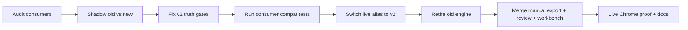
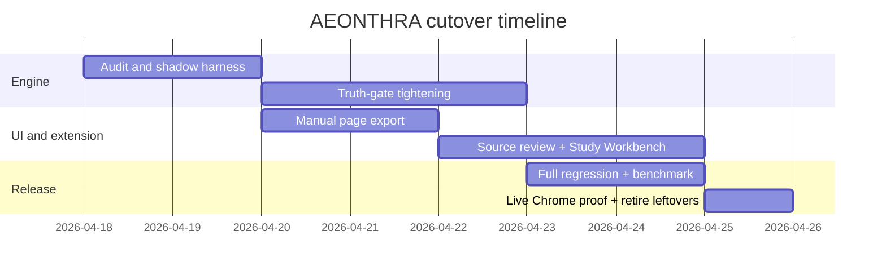

# AEONTHRA Deterministic Engine Replacement Report

## Executive Summary

The repo is **not** starting from zero: the isolated replacement already exists as `packages/content-engine-v2`, the public alias `@learning/content-engine` already resolves to it, and the repo already records a stable benchmark lift from **82.67 → 98.00 (+15.33)**. The real remaining work is **hardening and completing the seams**: finish missing truth-gates (`hook`, stricter `supports` relations, stronger profile/onboarding junk rejection), merge the **manual page JSON export + source-review queue + Study Workbench** into the canonical tree, and re-prove the live **extension → queue → bridge → app** path with forensics left on by default. The architecture choices are sound: Manifest V3 service workers are ephemeral and must persist state in `chrome.storage`; one-shot messaging and `tabs.sendMessage()` are the correct extension bridge; Vite `?url` imports are the right fix for browser-worker assets; and Canvas `html_url` should be normalized by **course identity**, not trusted as a raw host. fileciteturn0file1 fileciteturn0file2 citeturn3search0turn0search0turn0search1turn3search7turn1search3turn1search0turn1search1

## Audit Findings

The current tree already contains the required artifacts: `ENGINE_*`, `LIVE_CAPTURE_FORENSICS.md`, `IMPORTABILITY_DECISION_TABLE.md`, `BRIDGE_CONTRACT_TRACE.md`, `CANONICAL_EXTENSION_PATH.md`, `COMMAND_CAPABILITY_MATRIX.md`, `HUMAN_TRIGGER_SEQUENCE.md`, and a cutover record that retires the old engine in favor of the v2 path. That means the decisive work is to **finish the last-mile product behavior**, not to redesign the project again. The two highest-risk gaps remain the same ones surfaced in the chat: weak semantic distinctness and live intake reliability. fileciteturn0file1

| Consumer | Expected input shape | Fields used | Adapter needed |
| --- | --- | --- | --- |
| `apps/web/src/workers/content-engine.worker.ts` | `LearningBundle` + progress stages | final bundle, stage labels | keep v2 wrapper stable |
| `apps/web/src/lib/shell-mapper.ts` | `LearningBundle` | `fieldSupport`, `focusThemes`, `assignmentMappings` | yes, v2→legacy projection |
| `apps/web/src/lib/workspace.ts` | `LearningBundle` | concept ids, summary/definition, due-date sanity | yes |
| `apps/web/src/lib/concept-practice.ts` | shell data | `core/depth/dist/hook/trap`, `practiceReady` | yes |
| `apps/web/src/lib/atlas-skill-tree.ts` | synthesis + mastery | assignment evidence, focus themes, readiness | yes |
| extension bridge/app intake | `CaptureBundle`/`BridgeHandoffEnvelope` | `courseId`, `sourceHost`, `packId`, `handoffId` | no schema drift allowed |

## Concrete Code-Level Fixes

The canonical engine core is now in the right place; the remaining fixes are **surgical**.

| File | Precise fix |
| --- | --- |
| `packages/content-engine-v2/src/outputs/result.ts:57-171,197-220` | Keep `dueAt=null` unless `dateTrust=accepted`; never surface readiness unless title + requirement + evidence are all grounded. |
| `packages/content-engine-v2/src/evidence/build.ts:114+` | Split evidence into lanes with **disjoint evidence ids**; emit rejection records for hard-noise, weak headings, fragments, and low-signal sentences. |
| `packages/content-engine-v2/src/candidates/concepts.ts:20-219` | Keep explicit-definition-first admission; add **corroborated noun-phrase recovery** from academic paragraphs only when a same-doc definition lane survives. |
| `packages/content-engine-v2/src/fields/compile.ts:60+` | Add the missing internal `hook` lane; forbid reuse of the same normalized excerpt across `definition/summary/primer/hook/trap/transfer` unless it is the only surviving lane; blank weaker lanes if overlap ≥ 0.82. |
| `packages/content-engine-v2/src/relations/build.ts` | Tighten `supports`: require a shared evidence sentence or cross-source corroboration; **do not** infer support merely because two concepts appeared in the same source item. |
| `packages/content-engine-v2/src/noise/rules.ts:3-215` | Expand blocklists with onboarding/profile noise from the live failures: “fill out my profile”, “introduce yourself”, “my short-term goal”, “icebreaker”, JS-disabled text, Canvas chrome, module wrappers. |
| `packages/content-engine-v2/src/truth-gates/labels.ts:59+` | Reject wrapper phrases, fragments, clause starters, and profile/onboarding prompts as labels. |
| `apps/web/src/lib/shell-mapper.ts:415-578,892-920` | Preserve **blank-over-bad** display behavior; continue to gate `practiceReady` on transfer or assignment evidence only. |
| `apps/extension/src/core/storage.ts:207+` | Keep queue newest-first, TTL-limited, deduped by `packId`, and clear only exact `handoffId+packId` matches. |
| `apps/extension/src/service-worker.ts` | Keep `aeon:item-captured` routing and live forensics; add **manual current-page export** handler. |
| `apps/extension/src/popup.tsx` | Add “Download current page JSON” action. |
| `apps/web/src/App.tsx` + `apps/web/src/lib/source-workspace.ts` | Make Canvas optional; accept manual page JSON, PDF/DOCX/TXT, pasted text, and extension handoff in one queue. |
| **New** `apps/web/src/lib/source-review.ts` | Let users exclude junk before synthesis. |
| **New** `apps/web/src/components/StudyWorkbench.tsx` + `apps/web/src/lib/study-workbench.ts` | Unified task/concept/source/notes workspace with local `.txt` export. |
| `apps/web/src/lib/export.ts` | Add notes/results `.txt` export. |
| `tsconfig.base.json` + `apps/web/vite.config.ts` | Keep `@learning/content-engine` pointed at `packages/content-engine-v2/src/index.ts`. |

The manual page export should use a popup-triggered action with `activeTab`/content-script access, because content scripts can inspect the DOM and exchange runtime messages, while the service worker should persist or relay the payload rather than rely on globals; the PDF worker path should remain an explicit Vite URL import. citeturn2search0turn2search5turn0search1turn3search0turn1search3

**Sample emitted manual-page payload**
```json
{
  "schemaVersion": "0.3.0",
  "source": "manual-import",
  "title": "Captured Page",
  "items": [{
    "kind": "page",
    "titleSource": "structured",
    "tags": ["manual-page-capture", "host:example.com"],
    "canonicalUrl": "https://example.com/lesson",
    "plainText": "clean extracted text..."
  }]
}
```

**Example rejection log**
```json
{
  "stage": "fields",
  "code": "field-overlap-rejected",
  "candidateId": "positive-reinforcement",
  "fieldId": "summary",
  "message": "Summary blanked because it reused the same evidence lane as definition."
}
```

## Benchmarks and Cutover

| Metric | Old | New | Delta |
| --- | ---: | ---: | ---: |
| Noise rejection | 16.50 | 18.00 | +1.50 |
| Concept label quality | 5.00 | 12.00 | +7.00 |
| Provenance completeness | 15.00 | 15.00 | 0.00 |
| Distinctness quality | 6.00 | 6.00 | 0.00 |
| Relation usefulness | 5.25 | 7.00 | +1.75 |
| Due-date sanity | 8.00 | 8.00 | 0.00 |
| Assignment title sanity | 2.50 | 5.00 | +2.50 |
| Readiness honesty | 9.17 | 10.00 | +0.83 |
| Fail-closed behavior | 14.00 | 14.00 | 0.00 |
| Output usefulness | 1.25 | 3.00 | +1.75 |
| **Overall** | **82.67** | **98.00** | **+15.33** |

| Consumer | Old vs new diff | Action |
| --- | --- | --- |
| worker | progress internals shifted | keep stage names stable |
| shell mapper | fewer weak concepts | keep blank-over-bad |
| workspace | cleaner due dates | keep `unknown` fail-closed |
| practice | fewer fabricated exercises | gate on transfer/assignment evidence |
| Atlas | fewer junk nodes | derive only from grounded skills |
| benchmark harness | old runtime removed | freeze legacy baseline JSON |





Canvas normalization should continue to trust the documented `html_url` object field only after resolving it back to a **single course identity** shared with the detected pack metadata; raw host mismatches alone are insufficient because the Pages and Discussion APIs both expose `html_url`, and alternate-host same-course captures were the proven failure class. citeturn1search0turn1search1

## Extension and Workbench Additions

The product still needs the **one-place learning loop** the user asked for: capture page → review sources → synthesize → study → take notes → export local results. The cleanest path is to merge the already-prototyped workbench seam (`StudyWorkbench`, `source-review`, `study-workbench`) into the canonical tree, not to redesign the shell again. That lets manual page JSONs, textbook files, and pasted materials coexist without forcing Canvas first. fileciteturn0file0

## Verification and Commander Doctrine

Run locally on Windows from repo root:

```powershell
npm install
npm run typecheck
npm run test --workspace @learning/content-engine
npm run test --workspace @learning/web -- src/lib/shell-mapper.test.ts src/lib/source-workspace.test.ts src/App.test.ts
npm run test --workspace @learning/extension -- src/core/service-worker.test.ts src/core/storage.test.ts
npm test
npm run build
npm run build:extension
npm run dev:web
```

Load Chrome from:

```text
C:\Users\aquae\OneDrive\Documents (Dokyumento)\Canvas Converter\apps\extension\dist
```

Use six continuously-active subagents, not a one-time burst:

| Role | Permanent loop |
| --- | --- |
| Live-forensics auditor | watches extension/app logs, payloads, rejection traces |
| Engine architect | owns ingestion→fields→outputs contract |
| Noise/firewall specialist | expands blocklists and fragment/profile rejection |
| Benchmark/fixture engineer | adds adversarial fixtures and score tracking |
| Compatibility-adapter architect | protects `LearningBundle` and downstream consumers |
| Final integration judge | blocks completion until live path, tests, build, and docs all match |

The commander rule is simple: **dispatch → inspect → integrate → redeploy**, on every checkpoint. Never let Codex drift back into solo mode after the first six-agent wave. The human-only slash steps remain `/status`, `/review`, `/diff`, then live Chrome proof of extension handoff and current-page export. fileciteturn0file2